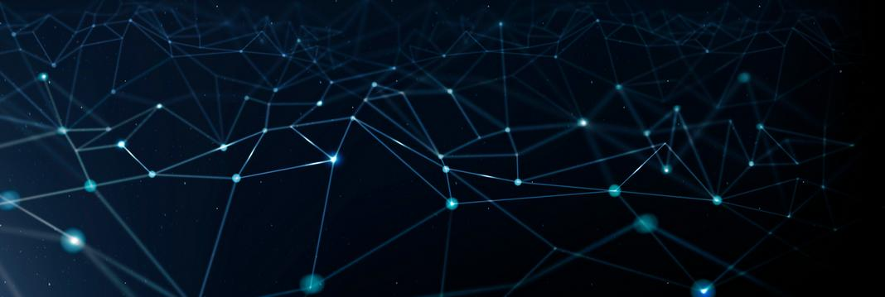

---
# Feel free to add content and custom Front Matter to this file.
# To modify the layout, see https://jekyllrb.com/docs/themes/#overriding-theme-defaults

permalink: /
title: 
layout: home
---

Graphs are increasingly utilized to represent and capture information about interconnected real-world entities. In response, a diverse landscape of graph database systems has emerged, designed to efficiently store, process, and analyze complex graph datasets. However, these systems often provide limited support for evolution mechanisms. As graph data becomes continuously and collaboratively curated, it is crucial to develop principled and practically tractable methods for defining and employing graph transformations and query languages.

Key challenges in this area include:

- **Practical Formalisms**: There is a lack of practical formalisms for describing graph transformations, as well as of appropriate syntactic and semantic primitives for capturing and querying various aspects of temporality, such as timeliness or versioning.
- **Human-Centered Design**: Upholding human aspects of graph transformation ecosystems, e.g., interoperability, reliability, scalability, and learning requirements calls for the design of new models and techniques, as well as for further discussions on the role and use of recent generative AI methods in this setting. 

The workshop aims to provide a platform for communities engaged with graph transformations and graph queries to share insights, ideas, and recent work. Topics of interest include, but are not limited to:

## Graph Transformations and Querying
- Graph transformations and querying methodologies
- Human-centered and human-based approaches to graph transformations
- Logical frameworks for graph transformations (e.g., rules, rewriting, algebra)
- Generative AI (LLM) methods for graph transformation
- Learning graph transformations (e.g., inductive learning, self-regulated learning)
- Applications of graph query languages for transformation specification
- Optimization strategies for graph transformation and their relation to query optimization

## Graph Changes and Evolution
- Formalisms to describe changes in graph data
- Dynamic graph data transformations
- Continuous queries and streaming graph processing

## Ecosystems for Graph Transformations
- Design and implementation of interoperability layers for graph data technologies
- Ensuring reliable processing of graph data (verification and validation)
- Scalable processing and querying of transformation-prone graph data
- Human aspects of graph transformation ecosystems (usability, data integrity, quality)
- Exploration of large, evolving graphs

We invite contributions that address these topics and encourage innovative approaches that advance the field of graph transformations and queries.
